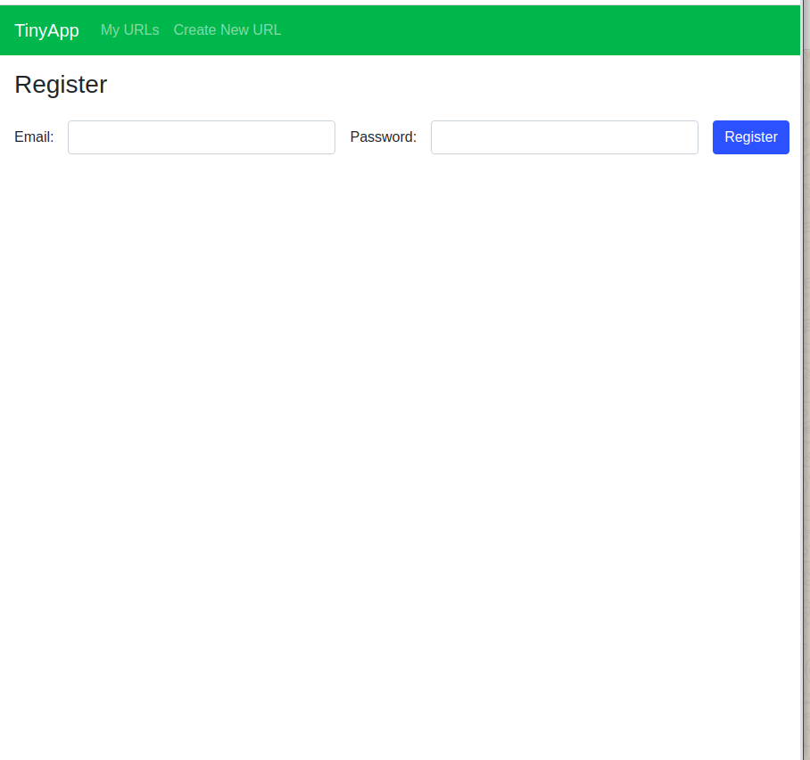
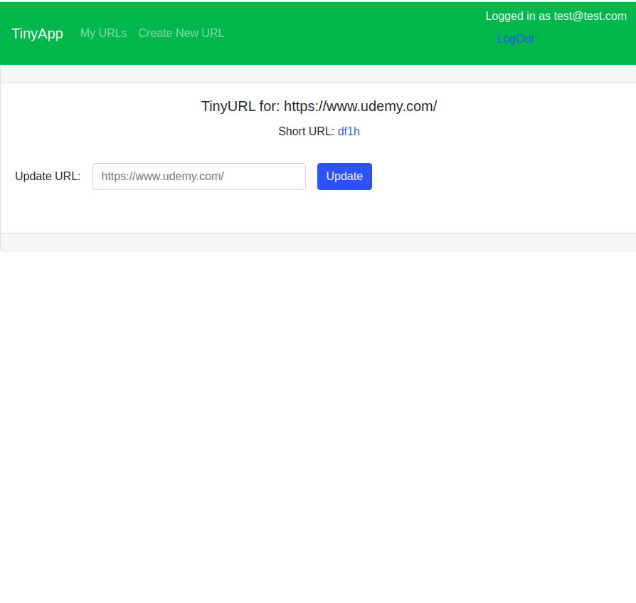

# TinyApp

TinyApp is a full stack web application built with Node and Express that allows users to shorten long URLs (à la bit.ly).

## Final Product

## Dependencies

- Node.js
- Express
- EJS
- bcrypt
- body-parser
- cookie-session

## Getting Started

- Install all dependencies (using the `npm install` command).

- Run the development web server using the `npm start` command.
- Open the browser at `http://localhost:8080/` and register first!

* If a feature is not behaving properly, delete the cookie and start over.